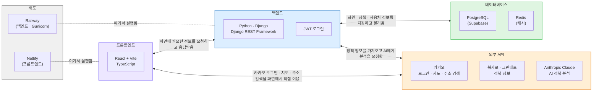
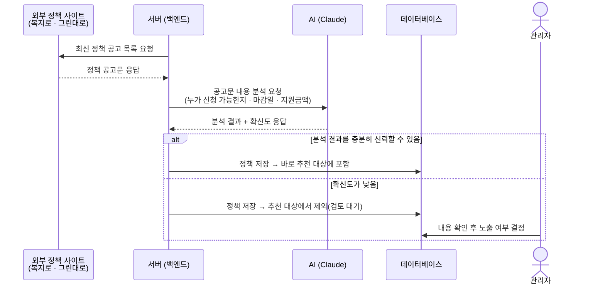
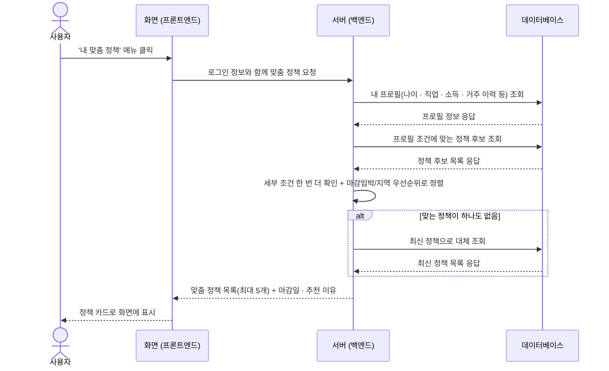
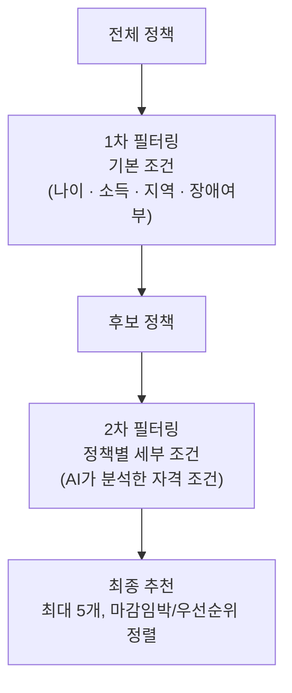

# 시스템 아키텍처



- **프론트엔드**: React + Vite(TypeScript), React Router — Netlify에 배포
- **백엔드**: Python + Django(Django REST Framework), JWT 로그인 — Railway에 배포(Gunicorn)
- **데이터베이스**: PostgreSQL(Supabase), Redis(캐시)
- **외부 API**: 카카오(로그인·지도·주소 검색), 복지로·그린대로(정책 정보), Anthropic Claude(AI 정책 분석)

## 기능 흐름: 정책 수집

정책 추천에 쓰이는 정책 데이터는 사용자가 요청하는 시점이 아니라, **그 전에
미리 준비**된다. 정기적으로(또는 관리자가 실행할 때) 아래 과정을 거쳐
데이터베이스에 정책이 쌓인다.



- 옥천군청 정책처럼 **지자체 홈페이지에 올라온 정책은 관리자가 공고문 원문을
  직접 입력**한다. 복지로·그린대로는 API 응답이 이미 JSON이라 서버가 바로 AI에게
  분석을 요청하지만, 옥천군청·수동입력 공고문은 줄글 형태이므로 관리자가 입력한
  뒤 같은 AI 분석 단계를 거쳐 구조화된 정보로 변환된다. 이렇게 만들어진 정책은
  "옥천 지역 큐레이션"으로 분류돼 추천 시 가장 먼저 보여준다.
- "확신도가 낮음"으로 분류된 정책은 화면에 노출되지 않고, 관리자가 검토해서
  내용이 맞으면 노출하도록 바꿀 수 있다.

## 기능 흐름: 정책 추천



- 이 흐름에서 **AI는 직접 호출되지 않는다.** 정책 데이터(자격 조건, 마감일 등)는
  복지로·그린대로에서 정기적으로 가져올 때 AI가 미리 분석해 데이터베이스에
  저장해 두고, 추천 시에는 이미 정리된 데이터에서 조건만 비교한다.
- "세부 조건 확인"은 단순 나이/지역/소득 조건으로 못 거르는 복합 조건(예: "귀농
  3년 이내이면서 농지 보유")을 정책별로 한 번 더 검사하는 단계다.

### 1차/2차 필터링 개념도



**왜 2단계가 필요한가 — 예시**

사용자 프로필: *32세 · 귀농 준비 중 · 농지 미보유 · 옥천 거주 1년차*

| 단계 | "청년 귀농 정착 지원금" 정책 | 결과 |
|---|---|---|
| 1차 필터 (만 18~40세 대상) | 32세 → 조건 만족 | ✅ 통과 |
| 2차 필터 (농지 보유자만 신청 가능) | 농지 미보유 | ❌ 제외 |

나이만 보면 추천될 정책이지만, 실제로는 신청 자격이 없는 "그림의 떡" 정책이다. 2차
필터링이 이런 정책을 걸러내서 진짜 신청 가능한 정책만 추천 목록에 남긴다.

### 매칭 로직 코드 (`lib/matching/policy_matcher.py`)

**1차 필터링** — DB 쿼리로 나이 · 직업 · 소득 · 장애 여부 등 단순 조건을 먼저 좁힌다.

```python
qs = Policy.objects.filter(
    is_active=True,
    min_age__lte=age,
    max_age__gte=age,
)

if occ_tags:
    # occupation_tags 없는 정책(전체 대상)도 포함
    qs = qs.filter(occupation_tags__exact=[]) | qs.filter(
        occupation_tags__overlap=occ_tags
    )

if income:
    # income_level 없는 정책(전체 소득 대상)도 포함
    qs = qs.filter(income_level__exact=[]) | qs.filter(
        income_level__contains=[income]
    )
```

**2차 필터링** — 1차로 못 거르는 복합 조건은 정책별 `condition_tree`(AND/OR/NOT/LEAF로
구성된 JSON, AI 분석 단계에서 함께 생성됨)를 사용자 프로필에 대해 재귀적으로 평가한다.
평가 중 오류가 나면 정책을 제외하지 않고 통과시킨다(안전한 기본값).

```python
matched = [p for p in qs if evaluate_tree(p.condition_tree, user_profile)]
```

**정렬** — 옥천 큐레이션(옥천군청 · 수동입력) > 귀농센터 > 복지로 순으로 먼저 묶고,
같은 출처 안에서는 마감일이 빠른 정책을 앞에 둔다. 마감일이 없는 정책은 가장 뒤로 보낸다.

```python
SOURCE_PRIORITY = {'옥천군청': 0, '수동입력': 0, '귀농센터': 1, '복지로': 2}

def sort_key(p: Policy):
    source_rank = SOURCE_PRIORITY.get(p.source, len(SOURCE_PRIORITY))
    if p.apply_end_date:
        days_left = (p.apply_end_date - today).days
        return (source_rank, 0, days_left)
    return (source_rank, 1, 0)

matched.sort(key=sort_key)
```

**대체(fallback)** — 위 과정을 거쳐 매칭된 정책이 0건이면, 가장 최근에 등록된 활성
정책으로 대체한다(`fallback: true`로 응답에 표시되어 프론트에서 "맞춤 정책은 없지만
최신 정책을 보여드려요" 처럼 안내할 수 있다).

```python
if not matched:
    matched = Policy.objects.filter(is_active=True).order_by('-created_at')[:MATCH_LIMIT]
```

## 상세 구성 (개발자용)

- **프론트엔드**: 로그인(카카오 OAuth), 지도(카카오맵 SDK)·주소검색(다음 Postcode)은
  프론트에서 직접 외부 SDK를 호출하고, 그 외 데이터는 백엔드 REST API를 통해 가져온다.
- **백엔드 (Django/DRF, Railway 배포)**
  - `apps/users`: 카카오 로그인 콜백 처리, 프로필, 내가 진단받은 정책 관리
  - `apps/policies`: 사용자 프로필 기반 정책 매칭(`lib/matching/policy_matcher`),
    정책 목록/상세 조회
  - `apps/places`: 사용처(LocalPlace) CRUD, 등록 시 주소→좌표 변환
    (`lib/services/geocoding`, 카카오 로컬 API 폴백)
  - `apps/regions`: 지역 정보
  - `lib/sync/adapters`: 복지로·그린대로(귀농센터) 정책 수집 어댑터 —
    management command(`sync_bokjiro`, `sync_greendaero`)로 주기 실행
  - `lib/parsing`: Anthropic Claude API를 이용해 정책/준비물 텍스트를 구조화 데이터로 파싱
- **DB**: Supabase(Postgres) — 정책, 체크리스트, 사용처, 사용자, 지역 등 저장
- **정책 출처(source)**: `복지로` / `귀농센터`(그린대로) / `옥천군청`(수동 큐레이션) /
  `수동입력` — 매칭 결과 정렬 시 옥천 큐레이션(`옥천군청`/`수동입력`)이 최우선 노출됨
  (`SOURCE_PRIORITY`, `lib/matching/policy_matcher.py`)
