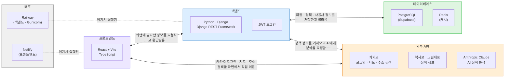

# 시스템 아키텍처

- **프론트엔드**: React + Vite(TypeScript), React Router — Netlify에 배포
- **백엔드**: Python + Django(Django REST Framework), JWT 로그인 — Railway에 배포(Gunicorn)
- **데이터베이스**: PostgreSQL(Supabase), Redis(캐시)
- **외부 API**: 카카오(로그인·지도·주소 검색), 복지로·그린대로(정책 정보), Anthropic Claude(AI 정책 분석)

## 상세 구성 (개발자용)

- **프론트엔드**: 로그인(카카오 OAuth), 지도(카카오맵 SDK)·주소검색(다음 Postcode)은
  프론트에서 직접 외부 SDK를 호출하고, 그 외 데이터는 백엔드 REST API를 통해 가져온다.
- **백엔드 (Django/DRF, Railway 배포)**
  - `apps/users`: 카카오 로그인 콜백 처리, 프로필, 내가 진단받은 정책 관리
  - `apps/policies`: 사용자 프로필 기반 정책 매칭(`lib/matching/policy_matcher`),
    정책 목록/상세 조회
  - `apps/places`: 사용처(LocalPlace) CRUD, 등록 시 주소→좌표 변환
    (`lib/services/geocoding`, 카카오 로컬 API 폴백)
  - `apps/regions`: 지역 정보
  - `lib/sync/adapters`: 복지로·그린대로(귀농센터) 정책 수집 어댑터 —
    management command(`sync_bokjiro`, `sync_greendaero`)로 주기 실행
  - `lib/parsing`: Anthropic Claude API를 이용해 정책/준비물 텍스트를 구조화 데이터로 파싱
- **DB**: Supabase(Postgres) — 정책, 체크리스트, 사용처, 사용자, 지역 등 저장
- **정책 출처(source)**: `복지로` / `귀농센터`(그린대로) / `옥천군청`(수동 큐레이션) /
  `수동입력` — 매칭 결과 정렬 시 옥천 큐레이션(`옥천군청`/`수동입력`)이 최우선 노출됨
  (`SOURCE_PRIORITY`, `lib/matching/policy_matcher.py`)
